# Case Study #6: Can Alignment Inspection
NI Vision Builder for Automated Inspection (VBAI)
FRA 626 Machine Vision in Smart Factory

## Objective
Inspect the alignment of stacked cat food cans using pattern matching.
Detect whether the top can label is correctly aligned or misaligned.

## Inspection Steps
1. Read Image File - Load images from folder
2. Vision Assistant - Convert RGB to Grayscale
3. Match Pattern - Locate bottom can as reference
4. Set Coordinate System - Set reference coordinate
5. Match Pattern - Check top can alignment
6. Set Inspection Status - Set PASS/FAIL
7. Custom Overlay - Show "ALIGNED" (green) or "MISALIGNED!" (red)

## Results
| Image   | Original Image | Top Can Status        | Result | Output Image |
|---------|----------------|-----------------------|--------|--------------|
| photo01 | 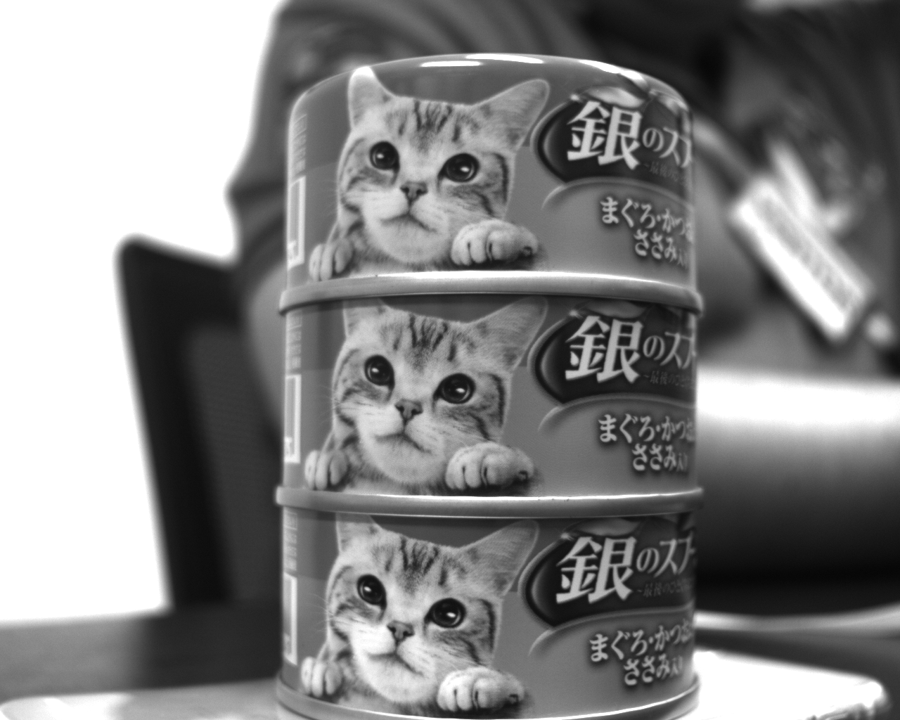 | Cat face front        | PASS   | 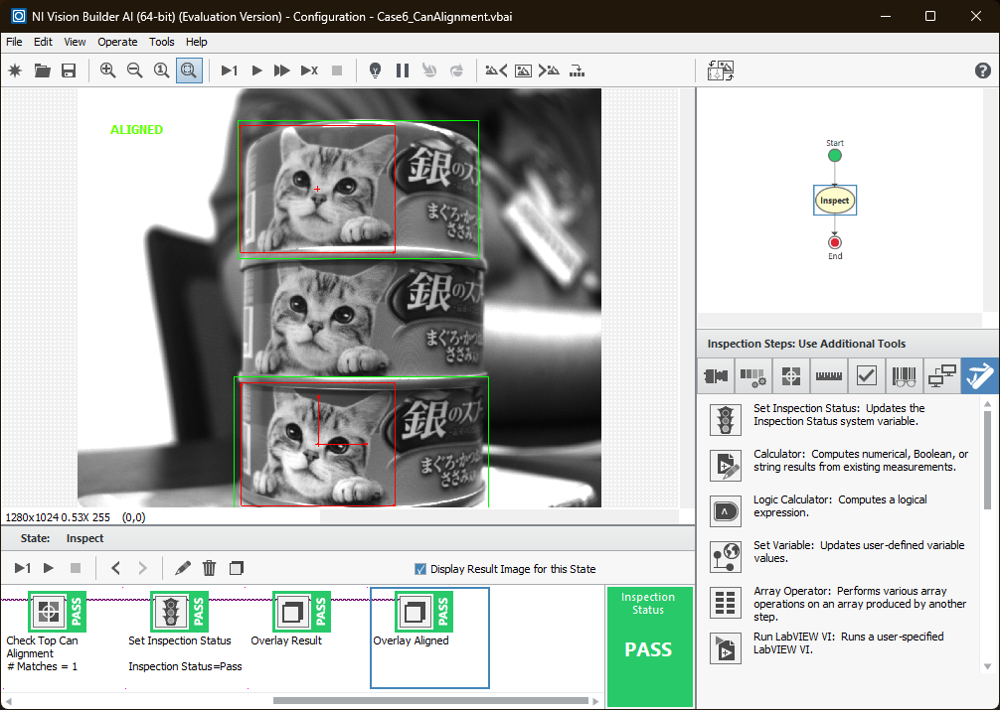 |
| photo02 | 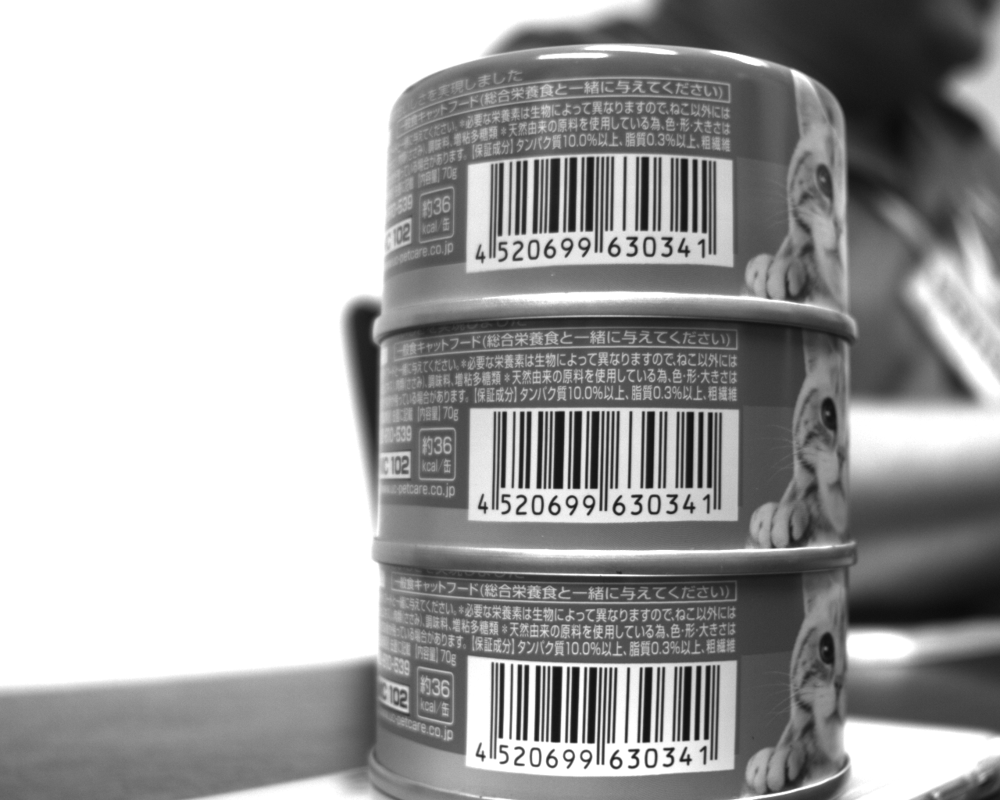 | Barcode visible       | FAIL   | 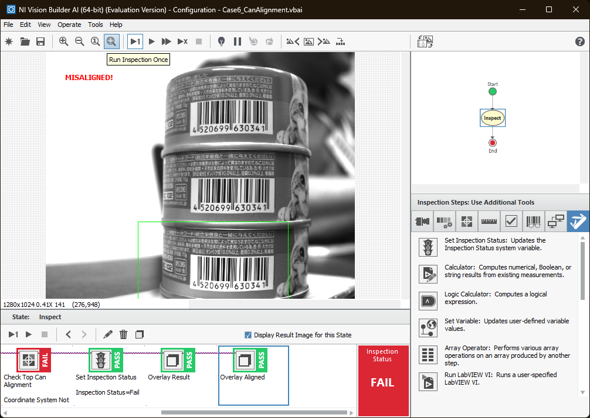 |
| photo03 | 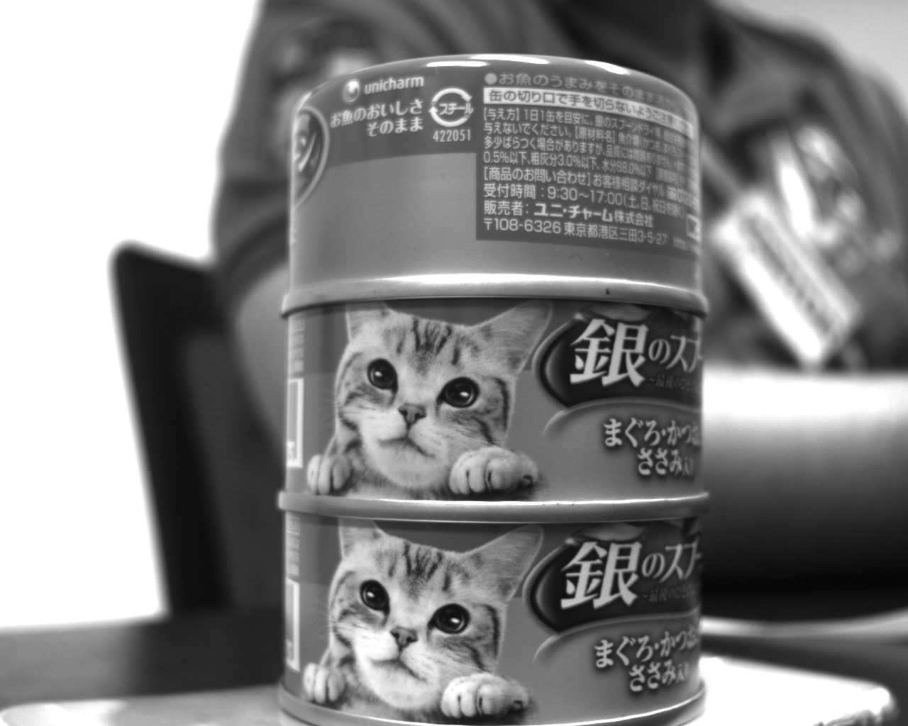 | Bottom of can visible | FAIL   | 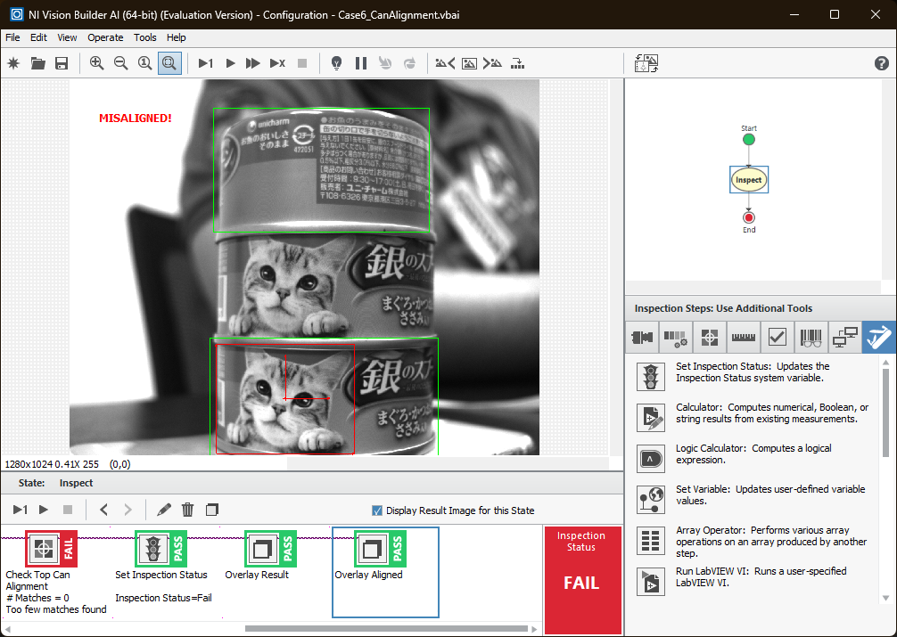 |
| photo04 | 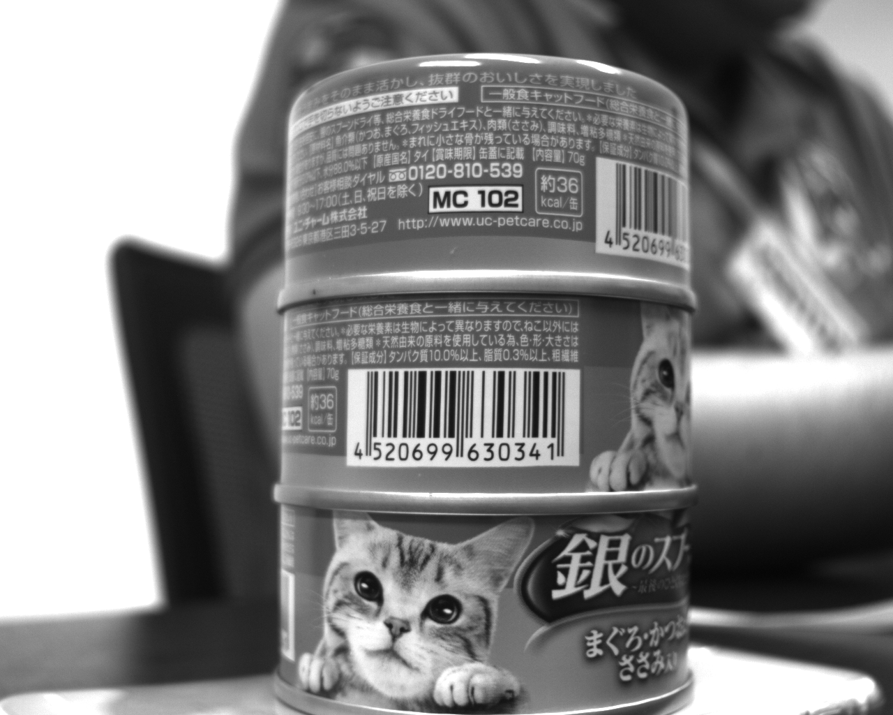 | Bottom of can visible | FAIL   | 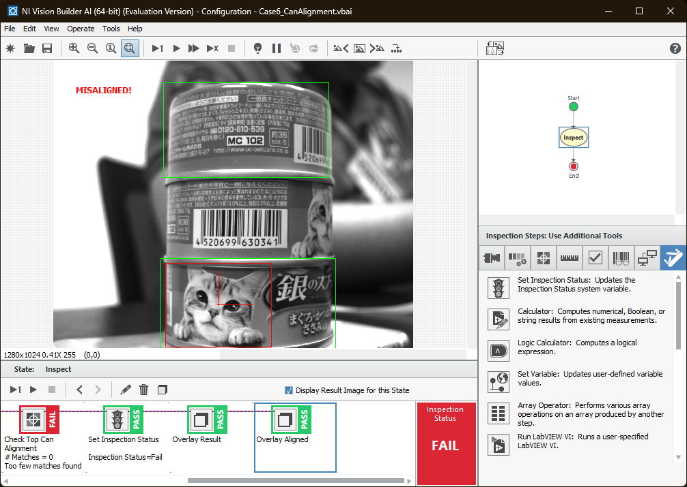 |
| photo05 | 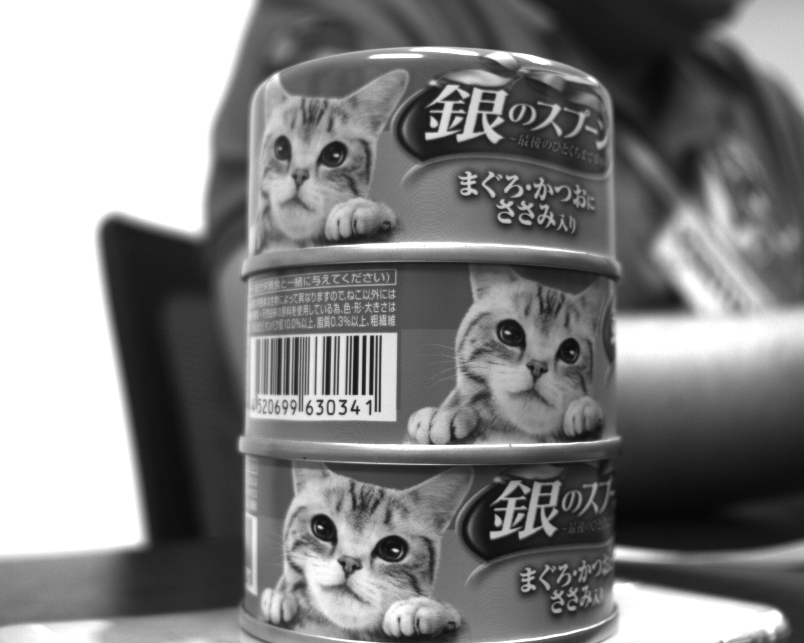 | Barcode visible       | FAIL   | 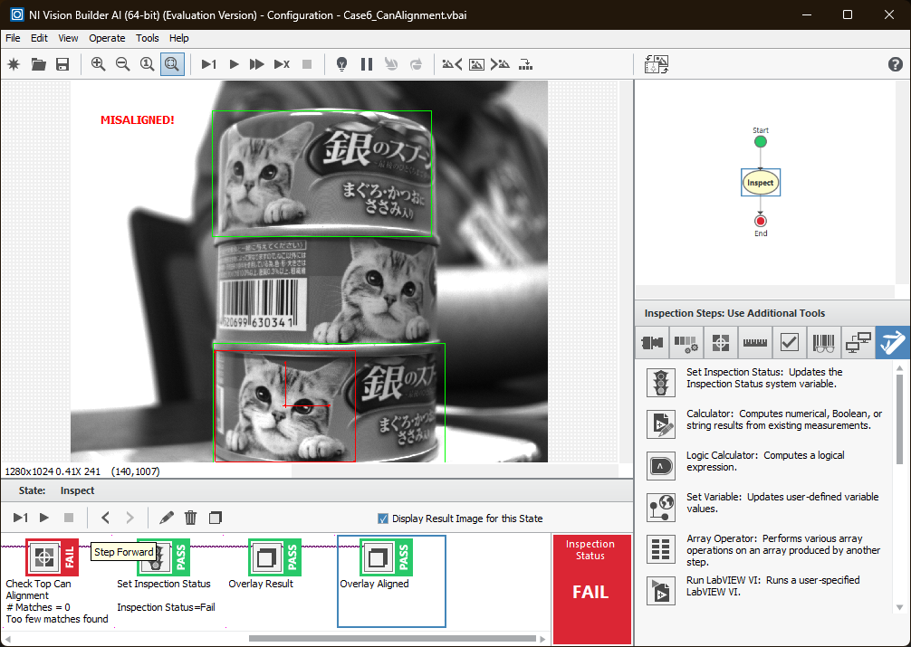 |
| photo06 | 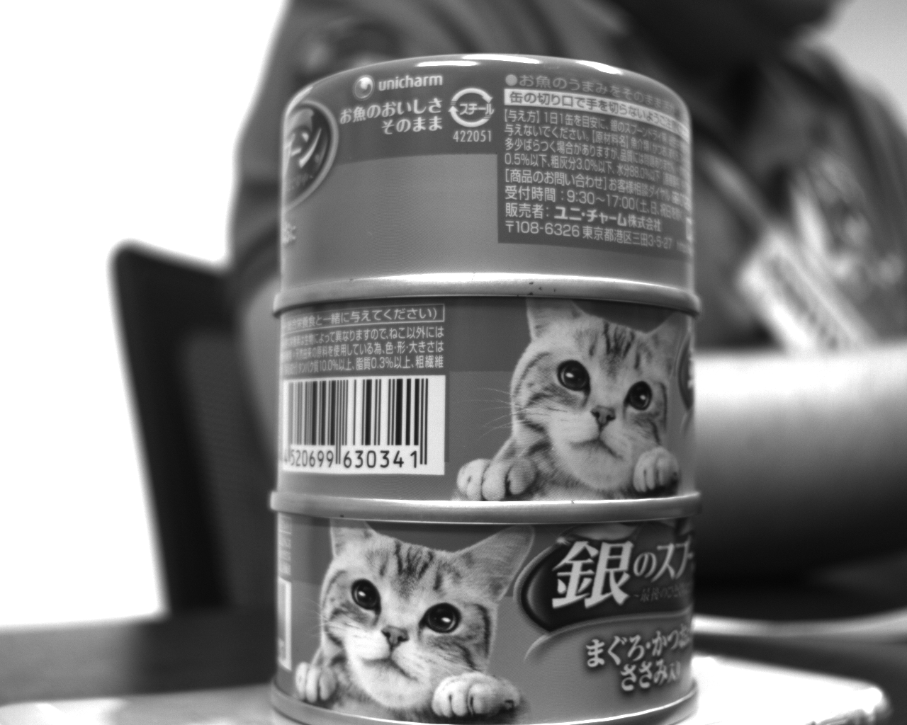 | Bottom of can visible | FAIL   | 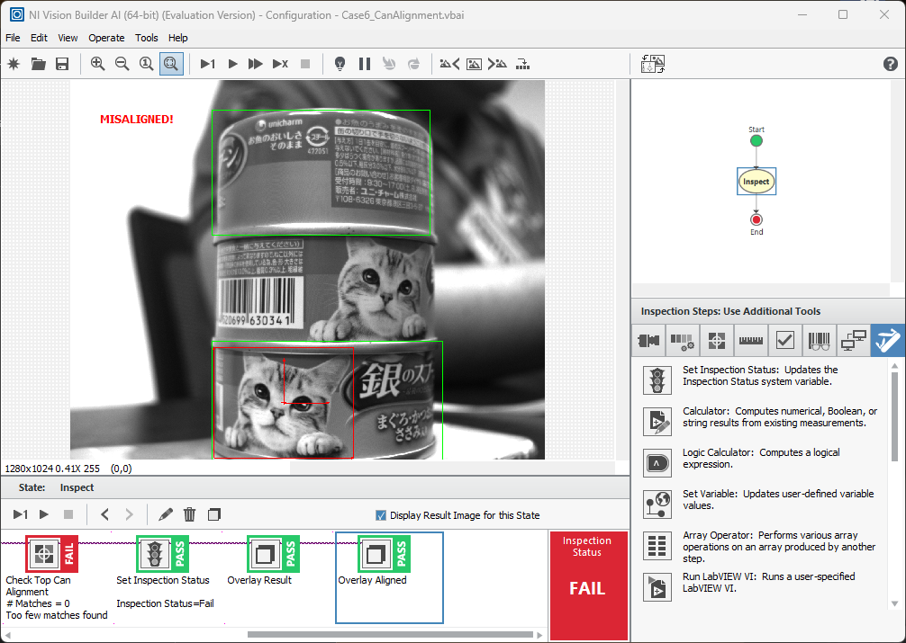 |

## Tools Used
- NI Vision Builder AI 2023 Q3 (64-bit)
- Match Pattern
- Vision Assistant
- Custom Overlay