# Case Study #7: Cognex In-Sight — Can Alignment

## Objective
Inspect alignment of 3 stacked cat food cans using Cognex In-Sight Explorer 6.5.1

---

## Images
- 6 photos of stacked cans (front, back, side angles)
- Converted PNG → BMP, resized to 480×640

---

## Tools Used

| Step | Tool | Purpose |
|------|------|---------|
| Locate Part | PatMax® Pattern | Find cat face label on top can |
| Inspect Part | Circle | Detect can rim presence |

---

## Inspection Results

| Original Image | Result Image | Image | View | Border | Pattern Found | Circle | Result |
|--------|------|-------|------|--------|---------------|--------|--------|
| 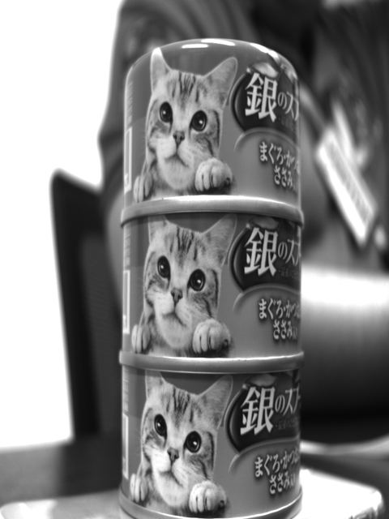 | 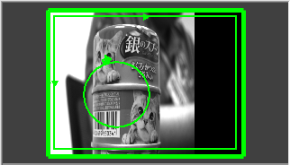 | photo01 | Front (cat face + barcode) | 🟢 Green | ✅ Yes | ✅ Present | **PASS** |
| 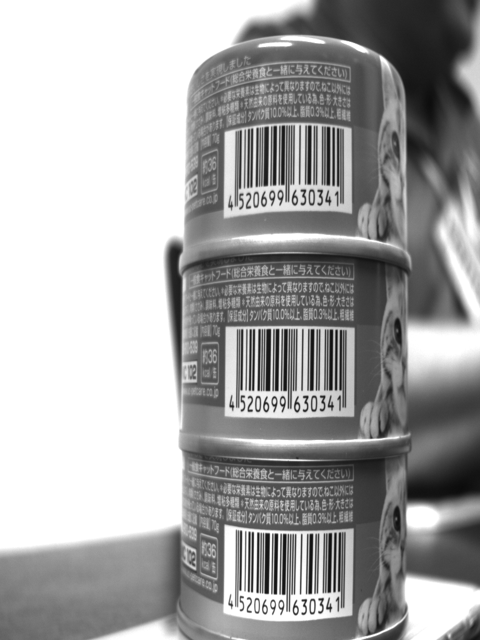 | 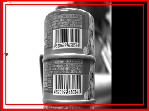 | photo02 | Back (barcode only) | 🔴 Red | ❌ No | ❌ Absent | **FAIL** |
| 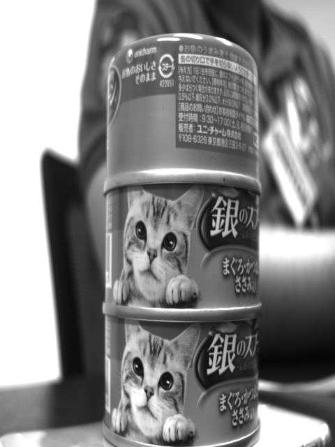 | 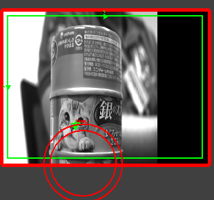 | photo03 | Side (top label + cat face) | 🔴 Red | ❌ No | ❌ Absent | **FAIL** |
| 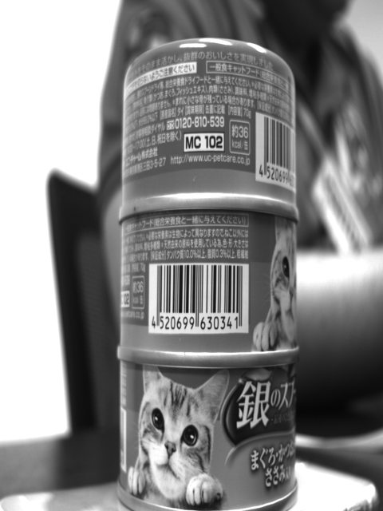 | 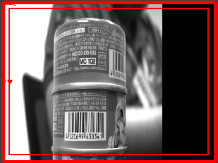 | photo04 | Back (barcode + top) | 🔴 Red | ❌ No | ❌ Absent | **FAIL** |
| 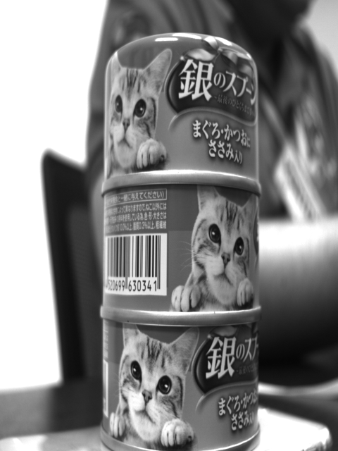 | 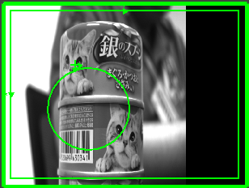 | photo05 | Front (cat face visible) | 🟢 Green | ✅ Yes | ✅ Present | **PASS** |
| 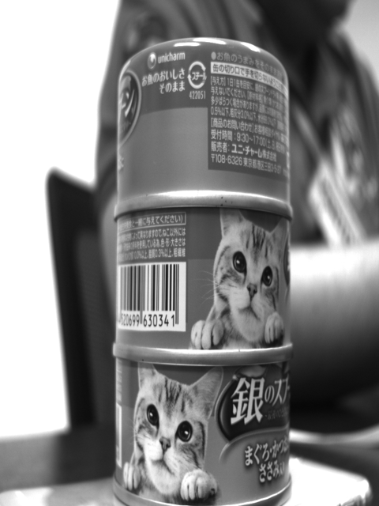 | 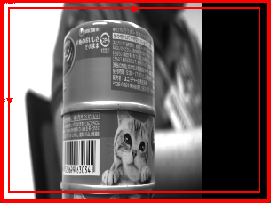 | photo06 | Back (barcode side) | 🔴 Red | ❌ No | ❌ Absent | **FAIL** |

> 🟢 Green border = Pass | 🔴 Red border = Fail

---

## Summary
- **Pass: 2/6 images** — front-facing views where cat face label is visible
- **Fail: 4/6 images** — back/side views where barcode faces camera
- The inspection correctly distinguishes aligned (front-facing) vs misaligned (rotated) can orientations

---

## Job File
`Case7_CanAlignment.job`